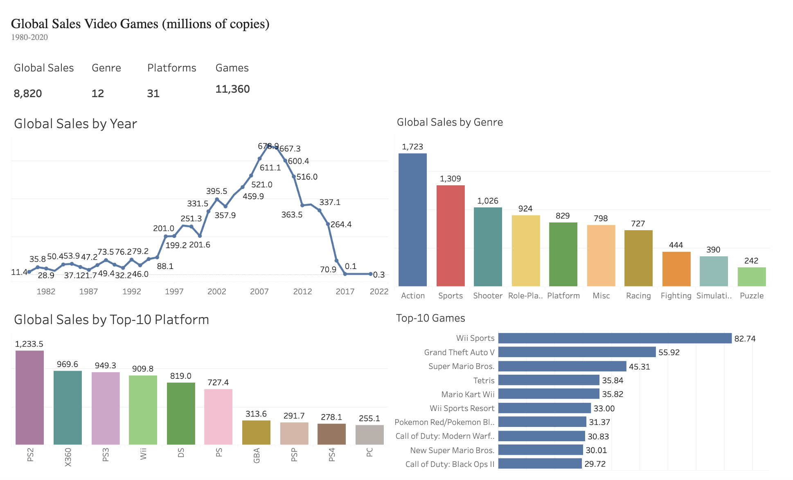

# video-games-sales-analysis
This project demonstrates an end-to-end data analytics workflow: - Data cleaning in Python - Exploratory Data Analysis (EDA) - Interactive dashboards in Tableau - Business insights and recommendations
# 🎮 Аналіз продажів відеоігор

## Опис проєкту

Цей проєкт присвячений аналізу історичних даних про продажі відеоігор. Метою дослідження є виявлення ключових тенденцій розвитку ринку, аналіз популярності платформ, жанрів та ігор, а також порівняння регіональних особливостей продажів.

У межах проєкту виконано повний цикл аналізу даних: від очищення та підготовки датасету до створення інтерактивних дашбордів у Tableau та формування бізнес-висновків.

## Використані інструменти

* Python
* Pandas
* Google Colab
* Tableau Public
* GitHub

## Етапи виконання

* Завантаження та дослідження датасету.
* Очищення даних та обробка пропущених значень.
* Перетворення типів даних.
* Проведення дослідницького аналізу даних (EDA).
* Створення інтерактивних дашбордів у Tableau.
* Формування бізнес-висновків.

## Дашборди

### 📊 Dashboard 1. Загальний аналіз продажів

Відображає ключові показники ринку:

* загальний обсяг світових продажів;
* кількість ігор, платформ, жанрів і видавців;
* найпопулярніші жанри;
* найуспішніші платформи;
* топ ігор за світовими продажами.

### 🌍 Dashboard 2. Регіональний аналіз

Дозволяє дослідити особливості продажів у різних регіонах:

* Північна Америка;
* Європа;
* Японія;
* Інші регіони.

На дашборді реалізовано параметр вибору регіону, що дає можливість аналізувати популярні жанри, платформи та ігри для кожного ринку.

### 📈 Dashboard 3. Аналіз тенденцій

Містить часовий аналіз ринку:

* динаміку світових продажів за роками;
* зміну популярності платформ;
* кількість випущених ігор за роками;
* найпопулярнішу гру кожного року.

## Основні бізнес-висновки

* Основний обсяг світових продажів формують кілька провідних платформ та ігрових франшиз.
* Популярність платформ змінюється відповідно до їхнього життєвого циклу та появи нових поколінь консолей.
* Споживчі вподобання суттєво відрізняються між регіонами, що підкреслює важливість адаптації маркетингових стратегій до локальних ринків.
* Аналіз історичних даних дозволяє виявляти ринкові тенденції та підтримувати прийняття стратегічних бізнес-рішень.

## Інтерактивна візуалізація

Переглянути інтерактивну Story у Tableau Public:

🔗 **https://public.tableau.com/app/profile/inessa.senchenko/viz/videogemas/Story1?publish=yes**

## Дані

Для аналізу використано відкритий датасет **Video Game Sales**, який містить інформацію про продажі відеоігор за платформами, жанрами, видавцями, роками випуску та регіонами.

## Автор

**Інесса Сенченко*

Проєкт створено як частину портфоліо з аналізу даних.
